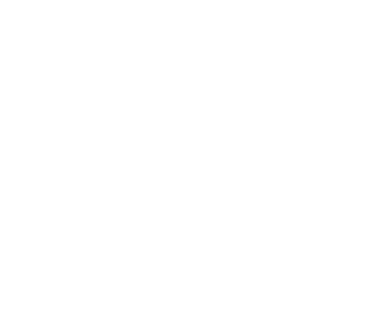

<div align="center">
    
</div>
<hr>

<div align="center">
DeadSync, as in "dead on sync", is a StepMania/ITG engine with Vulkan/OpenGL backends, focused on perfect sync and competitive-level performance. Cross-platform: Windows / Linux / BSD / macOS – x86_64 & ARM64.
<br><br>
⚠️ <b>DeadSync is under heavy development. Bugs are expected, features may change, and things *will* break. You have been warned.</b>
</div>
<hr>

## Prerequisites

Before building, ensure you have the following installed on your system:

1.  **Rust**: Install via [rustup](https://rustup.rs/).
2.  **Vulkan SDK**: Download and install the SDK for your operating system from the [LunarG website](https://www.lunarg.com/vulkan-sdk/).

### Windows build dependencies

-   **CMake**: Install from [cmake.org](https://cmake.org/download/).
-   **Ninja**: Install from [ninja-build.org](https://ninja-build.org/).

### Linux build dependencies (Ubuntu/Debian)
```bash
sudo apt update
sudo apt install --no-install-recommends build-essential cmake pkg-config libudev-dev libasound2-dev libvulkan-dev libgl1-mesa-dev
```

### BSD build dependencies (FreeBSD)
```bash
pkg install cmake python3 pkgconf alsa-lib alsa-plugins vulkan-validation-layers
```

## Getting Started

Follow these steps to get the game running:

1.  **Clone the Repository:**
    ```sh
    git clone --recurse-submodules https://github.com/pnn64/deadsync.git
    cd deadsync
    ```

2.  **Add Songs:**
    Create a folder named `songs` in the project root. Place your song packs inside this directory.
    *   *Example structure: `deadsync/songs/MyPack/MySong/MySong.ssc`*

3.  **Build the Project:**
    Compile the game in release mode for optimal performance:
    ```sh
    cargo build --release
    ```

4.  **Run the Game:**
    After a successful build, run the executable from the project root:

    *   **On Windows:**
        ```sh
        .\target\release\deadsync.exe
        ```
    *   **On Linux or macOS:**
        ```sh
        ./target/release/deadsync
        ```

## Configuration

After running the game for the first time, configuration files and a `save` directory will be generated in the project root.

### Game Settings
You can edit `deadsync.ini` to change various settings, including renderer, video resolution, VSync, `GfxDebug` (backend validation/debugging), and the default theme color.

### Input bindings

You can fully customize keyboard and gamepad controls in the `[Keymaps]` section of `deadsync.ini`. DeadSync maps **virtual actions** (e.g. `P1_Up`, `P1_Start`, `P1_Back`) to one or more **physical inputs**.

#### Keyboard

Use `KeyCode::<Name>` values, for example:

- `KeyCode::ArrowLeft`, `KeyCode::ArrowRight`
- `KeyCode::KeyA`, `KeyCode::KeyS`, `KeyCode::KeyD`, `KeyCode::KeyW`

Example:

```ini
[Keymaps]
P1_Up=KeyCode::ArrowUp,KeyCode::KeyW
P1_Start=KeyCode::Enter
P1_Back=KeyCode::Escape
```

#### Gamepad / Pad (low-level codes)

Gamepad/pad bindings are based on DeadSync’s `PadCode[...]` values emitted by the native input backend. The recommended way to bind a button is:

- `PadCode[0xDEADBEEF]` — bind to any gamepad button with that raw code.
- `PadCode[0xDEADBEEF]@0` — bind to that code, but only on gamepad `ID 0` (as shown in logs / sandbox).

To discover the codes for your device:

1. Start the game and go to the **Sandbox** screen by pressing `F4`.
2. Press buttons on your controller; you will see lines like:
   - `Gamepad 0 [uuid=...]: RAW BTN { PadCode[0x00030030], ... }`
3. Copy the `PadCode[...]` part (and optionally the `@0` device index) into `deadsync.ini`.

Example: bind P1 Start/Back to a specific button on gamepad 0:

```ini
[Keymaps]
P1_Start=PadCode[0x00030030]@0
P1_Back=PadCode[0x00030031]@0
```

Legacy high-level bindings like `PadDir::Up`, `PadButton::Confirm`, and `PadN::Dir::Left` are still accepted for convenience, but low-level `PadCode[...]` bindings are the most accurate and device-agnostic way to configure controllers.

### Profile & Online Features
A `save` directory is also created to store your personal data.

*   To enable online features with **GrooveStats**, edit the `save/profiles/00000000/groovestats.ini` file and add your API key and username. This allows the game to fetch your online scores.
*   You can also change your in-game display name in `save/profiles/00000000/profile.ini`.

## Contributing

We welcome contributions of all sizes. These notes are directional, not law—open a discussion or draft PR if you are unsure.

- Keep code simple and direct; stick to functional or procedural styles and avoid OOP patterns (even in Rust).
- Write small, single-purpose functions with clear names; compose simple pieces instead of building deep abstractions.
- Prefer immutability and pure functions; minimize global state and side effects so behavior stays predictable and testable.
- Reduce duplication by reusing and composing functions rather than repeating logic or adding one-off helpers.
- Bias toward efficient, low-overhead code: favor `Vec` and iterators, borrow instead of clone, and keep dependencies lean.

<h2>Acknowledgements</h2>
<p>
    DeadSync would not exist without years of work from the StepMania and ITG communities.
    In particular, we would like to acknowledge:
</p>
<ul>
    <li>
        <a href="https://github.com/stepmania/stepmania">StepMania</a> and its contributors
        for creating the original engine that made all of this possible, including the
        <a href="https://github.com/itgmania/itgmania/blob/beta/Docs/credits_old_Stepmania_Team.txt">original StepMania Team</a>
        and the
        <a href="https://github.com/itgmania/itgmania/blob/beta/Docs/credits_SM5.txt">StepMania 5 developers</a>.
    </li>
    <li>
        <a href="https://github.com/itgmania/itgmania">ITGmania</a> and its developers
        for shaping the modern ITG experience on dedicated machines.
    </li>
    <li>
        <a href="https://github.com/Simply-Love/Simply-Love-SM5">Simply Love</a>, its maintainers,
        and important forks such as
        <a href="https://github.com/zarzob/Simply-Love-SM5">zmod</a>, whose work defines much of
        the current ITG player experience.
    </li>
</ul>
<p>
    And more broadly, everyone who has written themes, noteskins, tools, and simfiles for the
    community over the years. ❤️
</p>
